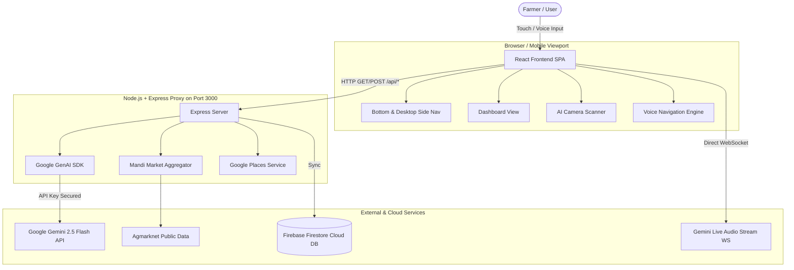
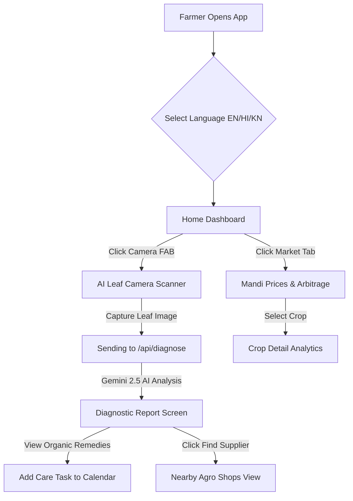

# Working Technical Documentation: KisanAI (AgriSmart AI)

## 1. Project Overview

- **Project Name:** KisanAI (AgriSmart AI / AgroVision AI)
- **Purpose:** KisanAI is a comprehensive, AI-driven hyper-local agricultural decision-support and disease diagnostic workspace tailored specifically for smallholder farmers across India and multilingual rural regions. It combines real-time vision diagnostics, localized weather telemetry, live Mandi market arbitrage analysis, AI agro-advisory chat, ITK (Indigenous Technical Knowledge) pest remedies, soil analysis, government scheme finders, voice navigation, and an integrated Android native workspace generator.
- **Target Users:** Smallholder farmers, agricultural extension workers, agronomy researchers, rural mandis (trading hubs), and agricultural cooperative administrators.
- **Main Features:**
  - **AI Leaf & Crop Disease Diagnosis:** High-accuracy disease identification using multimodal Gemini 2.5 & Gemma vision models with severity metrics, chemical/organic treatment recommendations, and localized supplier matching.
  - **Live Audio & Voice Navigation:** Real-time speech interaction and voice command navigation supporting English, Hindi (हिंदी), and Kannada (ಕನ್ನಡ) for low-literacy accessibility.
  - **Mandi Market Prices & Regional Arbitrage:** Multi-mandi price tracking, historical price trends with Recharts, and automated cross-mandi profit arbitrage calculators factoring distance and transportation logistics.
  - **Soil Health Analysis & Fertilizer Recommendation:** Multi-parameter NPK (Nitrogen, Phosphorus, Potassium), pH, and organic carbon soil testing interpreter with tailored crop suitability matrices.
  - **Government Scheme Finder & ITK Knowledge Base:** AI-driven matching for central and state agricultural subsidy schemes (e.g., PM-KISAN, PMFBY) combined with validated traditional/organic farming knowledge (ITK).
  - **Interactive Farm Task Calendar:** Urgency-prioritized task scheduler with weather advisory sync and local storage persistence.
  - **Firebase Firestore Synchronization:** Persistent cloud storage for farmer scan histories, task calendars, community posts, and regional supplier directory entries.
  - **Android Native Project Generator:** Live web-to-Android Kotlin/Jetpack Compose source generator permitting one-click mobile app export.
- **Problem Solved:** Bridges the agricultural information asymmetry gap where farmers suffer crop yield losses up to 40% due to delayed pest identification, volatile mandi middleman pricing, lack of localized soil advisories, and language barriers.
- **Overall Goal:** Empower farmers with an intelligent, voice-first, offline-resilient, single-pane dashboard that maximizes crop yield, reduces input costs, and enhances net profit per acre.

---

## 2. Tech Stack

### Frontend
| Framework/Library | Version | Purpose |
| :--- | :--- | :--- |
| **React** | `18.3.1` | Core UI component framework for declarative component-driven user interfaces. |
| **Vite** | `6.2.0` | Ultra-fast frontend build tool and dev server with middleware support. |
| **TypeScript** | `5.5.3` | Type-safe JavaScript superset ensuring compile-time interface verification. |
| **Tailwind CSS** | `@tailwindcss/vite 4.0.0` | Utility-first CSS framework for ultra-responsive, mobile & laptop optimized styling. |
| **Motion (Framer Motion)** | `12.4.10` | High-performance spring-physics UI animations, route transitions, and layout morphing. |
| **Recharts** | `2.15.1` | Interactive data visualization library for price trends and crop growth projections. |
| **Lucide React** | `0.475.0` | Clean vector iconography for UI consistency. |
| **Canvas Confetti** | `1.9.4` | Interactive celebratory visual feedback upon task or diagnosis completions. |
| **Sonner** | `2.0.1` | Toast notification manager for background task alerts and feedback. |

### Backend
| Technology | Version | Purpose |
| :--- | :--- | :--- |
| **Node.js** | `>=18` | Server-side runtime environment for Express and Vite middleware. |
| **Express.js** | `4.21.2` | Robust Web server framework handling REST API endpoints and proxying AI requests. |
| **tsx** | `4.19.3` | Direct TypeScript execution engine for Node.js backend environment in development. |
| **esbuild** | `0.25.0` | High-speed bundler compiling `server.ts` into CommonJS (`dist/server.cjs`) for production. |

### Database & Authentication
| Technology | Service | Purpose |
| :--- | :--- | :--- |
| **Firebase Firestore** | NoSQL Database | Cloud document database storing farmer scan histories, task items, community discussions, and verified agro-suppliers. |
| **Firebase Auth** | Anonymous / Email | User session management and secure document ownership rules. |

### External APIs
| API Service | Endpoint / Function | Purpose |
| :--- | :--- | :--- |
| **Govt. Agmarknet / Mandi API** | `/api/mandi-prices` | Fetches real-time market prices, arrivals, and min/max rates across state mandis. |
| **Open-Meteo Weather API** | `https://api.open-meteo.com/v1/forecast` | Fetches 7-day temperature, rainfall, humidity, and wind speed telemetry without requiring API keys. |
| **Google Places API (New)** | `/api/nearby-suppliers` | Discovers nearby agro-chemical stores, seed banks, and equipment rental suppliers with coordinates. |

### AI Services
| Model / SDK | Purpose | Integration Location |
| :--- | :--- | :--- |
| **Google GenAI SDK (`@google/genai`)** | Server-side Gemini 2.5 Flash & Pro model calls | `/server.ts`, `/src/services/gemini.ts` |
| **Gemini 2.5 Flash (`gemini-2.5-flash`)** | Multimodal crop leaf image disease diagnosis & fast agro chat | `/server.ts` (`/api/diagnose`, `/api/chat`) |
| **Gemma 2 27B / Local Fallback (`gemma-2-27b-it`)** | Local/Offline fallback inference for disease analysis | `/src/services/gemma.ts` |
| **Gemini Multimodal Live API (`wss://generativelanguage.googleapis.com/...`)** | Real-time audio streaming voice interaction | `/src/components/LiveAudioChat.tsx` |

---

## 3. Project Architecture

### Architecture Overview
KisanAI follows a **Full-Stack Hybrid Architecture** combining a client-side React Single Page Application (SPA) with a server-side Express backend proxying sensitive Google GenAI requests, weather aggregation, and Mandi data processing.



### Request & Response Lifecycle
1. **User Action:** Farmer captures a crop leaf photo or requests an AI diagnosis.
2. **Client Preparation:** Image is captured via HTML5 Canvas/MediaDevices, encoded to Base64, and transmitted to `/api/diagnose`.
3. **Server Processing:** `server.ts` receives the request, constructs a structured prompt using `@google/genai`, attaches the image payload, and executes `ai.models.generateContent`.
4. **Structured JSON Extraction:** Gemini returns a structured JSON response containing disease name, confidence score, organic remedies, chemical treatments, and severity metrics.
5. **Persistence & UI Render:** Response is saved to Firestore under `scans` collection and instantly updated on the client with Framer Motion animations.

---

## 4. Folder Structure

```
├── .env.example                # Template for environment configuration
├── firebase-applet-config.json  # Firebase SDK credentials and configuration
├── firebase-blueprint.json      # Firestore schema definition blueprint
├── firestore.rules             # Firestore security rules
├── metadata.json               # Applet capabilities & permissions declaration
├── package.json                # Project dependencies and npm build scripts
├── server.ts                   # Express backend server with Gemini & Mandi APIs
├── vite.config.ts              # Vite frontend build setup
├── src/
│   ├── App.tsx                 # Main application controller & routing state
│   ├── AuthProvider.tsx        # Firebase authentication state wrapper
│   ├── firebase.ts             # Firebase client initialization
│   ├── main.tsx                # React DOM entry point
│   ├── i18n.ts                 # Internationalization configuration
│   ├── types.ts                # Master TypeScript interfaces & types
│   ├── constants.ts            # Default mock data, crops, and scheme constants
│   ├── index.css               # Tailwind CSS import & global styles
│   ├── components/             # UI Components (23 modular components)
│   │   ├── AndroidWorkspace.tsx # Live Android Jetpack Compose generator
│   │   ├── ArbitrageAnalyzer.tsx# Multi-mandi price arbitrage calculator
│   │   ├── BottomNav.tsx       # Dual Mobile Bottom Nav & Laptop Side Rail (#desktop-side-nav)
│   │   ├── Calendar.tsx        # Farm task calendar & weather advisories
│   │   ├── CameraDiagnosis.tsx # Real-time camera leaf capture modal
│   │   ├── Chat.tsx            # AI Multilingual Kisan Assistant
│   │   ├── Community.tsx       # Farmer social Q&A forum
│   │   ├── CropDetails.tsx     # Deep-dive crop analytics & stage breakdown
│   │   ├── Dashboard.tsx       # Primary home dashboard view
│   │   ├── Diagnosis.tsx       # Scan diagnostic report & treatment view
│   │   ├── ErrorBoundary.tsx   # React runtime error boundary recovery
│   │   ├── FileUploader.tsx    # Drag-and-drop leaf image upload fallback
│   │   ├── History.tsx         # Saved scan diagnostic history
│   │   ├── LanguageSelector.tsx# Quick language switcher (EN/HI/KN)
│   │   ├── LiveAudioChat.tsx   # WebSocket real-time voice assistant
│   │   ├── Market.tsx          # Mandi price trends & market analytics
│   │   ├── Profile.tsx         # Farmer farm size & regional settings
│   │   ├── SchemeFinder.tsx    # Govt subsidy scheme matcher
│   │   ├── SoilAnalysis.tsx    # Soil NPK & pH analysis guide
│   │   ├── Suppliers.tsx       # Nearby seed/chemical stores locator
│   │   ├── VoiceNavigation.tsx # Continuous background speech listener
│   │   ├── WeatherForecast.tsx # 7-day weather telemetry card
│   │   └── WhatsAppShare.tsx   # One-click WhatsApp report share button
│   ├── data/                   # Static offline data stores
│   │   ├── itk-knowledge.ts    # Indigenous Technical Knowledge database
│   │   ├── mandi-data.json     # Offline mandi dataset fallback
│   │   └── market_data.json    # Historical commodity price series
│   ├── hooks/                  # Custom React Hooks
│   │   └── useGeolocation.ts   # Device GPS coordinates hook
│   ├── services/               # API & service client adapters
│   │   ├── connectivity.ts     # Online/offline network status detector
│   │   ├── gemini.ts           # Frontend Gemini AI helper
│   │   ├── gemma.ts            # Gemma 2 fallback inference engine
│   │   ├── marketApi.ts        # Client Mandi API fetcher
│   │   ├── placesService.ts    # Google Places proxy adapter
│   │   └── weatherService.ts   # Open-Meteo weather fetcher
│   └── utils/                  # Utility helper functions
│       └── productImages.ts    # Crop image asset mapping
```

---

## 5. File-by-File Documentation

### `server.ts`
- **Purpose:** Full-stack Express HTTP server that serves API endpoints and proxies Gemini 2.5 Flash calls.
- **Key Routes:**
  - `POST /api/diagnose`: Accepts image Base64, calls Gemini 2.5 Flash, returns structured disease diagnosis.
  - `POST /api/chat`: Handles chat messages with agricultural system prompt and multi-turn context.
  - `GET /api/mandi-prices`: Returns live commodity market prices with search/filter parameters.
  - `POST /api/soil-analysis`: Processes soil test values (NPK, pH) and outputs fertilizer recommendations.
  - `POST /api/match-schemes`: Matches farmer profile to subsidies.
- **Used By:** React frontend via relative fetch calls (`/api/*`).

### `src/App.tsx`
- **Purpose:** Root application component managing active screen state (`activeScreen`), global language (`language`), selected crop (`selectedCrop`), diagnosis results, and navigation overlays.
- **Key Functions:**
  - `handleFileSelect(file)`: Sends uploaded leaf images to `/api/diagnose` or Gemma fallback.
  - `handleAddTask(task)`: Appends farm tasks to state and synchronizes with Firestore.
  - `renderScreen()`: Switch-case rendering active screen components with `AnimatePresence` animations.

### `src/components/BottomNav.tsx`
- **Purpose:** Dual responsive navigation container providing both the mobile curved bottom bar and the desktop/laptop vertical sidebar navigation rail (`id="desktop-side-nav"`).
- **Features:** Includes animated active tab indicators, tooltips on hover, and central floating action button for the camera scanner.

### `src/components/Dashboard.tsx`
- **Purpose:** Main landing screen displaying current location weather summary, quick AI camera diagnosis card, urgent farm tasks, trending mandi prices, and quick access feature grid.

### `src/components/CropDetails.tsx`
- **Purpose:** Comprehensive crop detail view featuring Recharts price history, growth stage timeline breakdown, weather impact cards, nearby suppliers list, and farmer reviews.

---

## 6. Component Documentation

### `BottomNav`
- **Props:** `activeScreen: Screen`, `onScreenChange: (s: Screen) => void`, `language: Language`, `onCameraOpen: () => void`.
- **State:** Active tab matches route dynamically.
- **Layout:** On desktop (`md:` breakpoint), renders `id="desktop-side-nav"` fixed on the left with vertical alignment, brand icon, active pill animation, and laptop hover tooltips.

### `Diagnosis`
- **Props:** `result: DiagnosisResult | null`, `imageUrl: string | null`, `language: Language`, `onBack: () => void`, `onAskAI: () => void`.
- **Functionality:** Displays disease severity gauge, organic treatment vs chemical control tabs, dosage instructions, and one-click WhatsApp report generator.

### `ArbitrageAnalyzer`
- **Props:** `cropName: string`, `currentPrice: number`.
- **Functionality:** Compares commodity prices across nearby regional mandis (e.g., Azadpur, Vashi, Kolar), calculates transportation costs based on distance, and computes net profit arbitrage opportunities.

---

## 7. User Journey



---

## 8. State Management

- **Local & Component State:** Managed via standard React `useState` and `useEffect` hooks for transient UI states (e.g., active filters, search text, modal visibilities).
- **Global Application State:** Centralized in `App.tsx` and lifted to parent props, including:
  - `activeScreen`: Current view route (`'home' | 'market' | 'diagnosis' | 'calendar' | 'chat' | ...`).
  - `language`: Selected ISO language code (`'en' | 'hi' | 'kn'`).
  - `tasks`: Array of farm calendar tasks.
  - `lastDiagnosis`: Latest disease diagnostic result object.
- **Cloud Persistence:** Managed via Firebase Firestore hooks (`/src/firebase.ts` and `/src/AuthProvider.tsx`), synchronizing scan logs and task lists to Firestore collections in real-time.

---

## 9. API Documentation

### `POST /api/diagnose`
- **Description:** Analyzes a crop leaf photo for disease identification.
- **Request Body:** `{ image: "data:image/jpeg;base64,...", language: "hi" }`
- **Response Format:**
```json
{
  "cropName": "Tomato",
  "disease": "Early Blight (Alternaria solani)",
  "confidence": 94,
  "severity": "Moderate",
  "symptoms": ["Concentric dark rings on mature leaves", "Yellow halo surrounding spots"],
  "organicTreatment": ["Apply Neem oil extract (5ml/L)", "Remove affected lower leaves"],
  "chemicalTreatment": ["Mancozeb 75% WP @ 2g/L water", "Copper Oxychloride @ 3g/L"],
  "preventativeMeasures": ["Rotate crops with non-solanaceous crops", "Ensure drip irrigation to keep foliage dry"]
}
```

---

## 10. Database Documentation (Firestore)

### Collection Schemas

#### 1. `scans`
- `id` (string): Unique document ID.
- `userId` (string): Auth UID of farmer.
- `timestamp` (timestamp): Scan date & time.
- `cropName` (string): Identified crop name.
- `disease` (string): Diagnosed disease name.
- `confidence` (number): Confidence percentage.
- `imageUrl` (string): Cloud storage or Base64 reference URL.

#### 2. `tasks`
- `id` (string): Task ID.
- `title` (string): Actionable task title (e.g., "Apply Mancozeb Spray").
- `date` (string): ISO date string.
- `completed` (boolean): Task status boolean.
- `urgent` (boolean): High priority flag.

---

## 11. Authentication & Security

- **Authentication Method:** Firebase Authentication supporting Anonymous guest sign-ins and persistent user credentials.
- **Security Rules (`firestore.rules`):**
  - Document read/write permissions locked to `request.auth.uid == resource.data.userId` ensuring strict multi-tenant data isolation.
  - Public read access permitted for static market mandi caches and community knowledge items.

---

## 12. UI / UX Documentation

- **Design Philosophy:** Clean, high-contrast, warm earthy palette (`#1B5E20` primary emerald, `#2E7D32` accent green, soft off-white canvas `#F8F9FA`).
- **Responsive Adaptability:**
  - **Mobile:** Curved bottom navigation bar with elevated floating camera action button.
  - **Laptop/Desktop:** Vertical navigation rail (`#desktop-side-nav`) fixed on the left with active spring indicators, hover tooltips, and spacious multi-column grid dashboard.
- **Accessibility:** Touch target sizes strictly $\ge 48\text{px}$, high-contrast typography (Plus Jakarta Sans body + Playfair display headers), and multi-lingual voice feedback.

---

## 13. Environment Variables

| Variable | Scope | Required | Description |
| :--- | :--- | :--- | :--- |
| `GEMINI_API_KEY` | Server-Side Only | Yes | Private Google Gemini API key used inside `server.ts`. Never exposed to browser. |
| `VITE_FIREBASE_API_KEY` | Client-Side | Optional | Firebase client SDK authentication key. |
| `VITE_FIREBASE_PROJECT_ID` | Client-Side | Optional | Firebase project identifier (`ai-studio-025bccd7...`). |

---

## 14. Build & Deployment

- **Development Server:** Launched via `npm run dev` running `tsx server.ts` on port `3000`.
- **Production Build:**
  1. Frontend compiled via `vite build` to static assets in `/dist`.
  2. Server compiled via `esbuild server.ts --bundle --platform=node --format=cjs --outfile=dist/server.cjs`.
- **Production Execution:** Executed via `npm run start` running `node dist/server.cjs` on port `3000`.

---

## 15. Future Improvements

1. **Edge AI Model Quantization:** Deploy TensorFlow Lite / ONNX Gemma vision models directly in WebAssembly for 100% offline crop diagnosis without cellular network dependency.
2. **IoT Sensor Gateway Integration:** Connect LoRaWAN soil moisture and micro-climate sensors directly to the farm dashboard.
3. **Automated Mandi Price Push Notifications:** Send daily SMS / WhatsApp price alerts to farmers when target commodity prices spike in local mandis.
